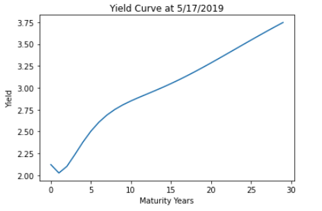
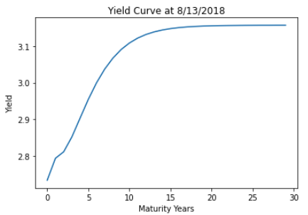
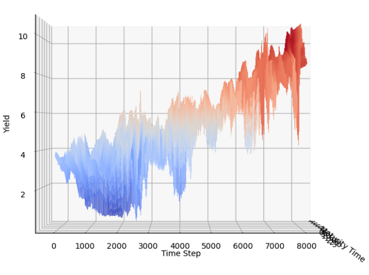
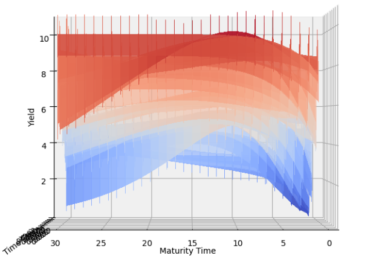
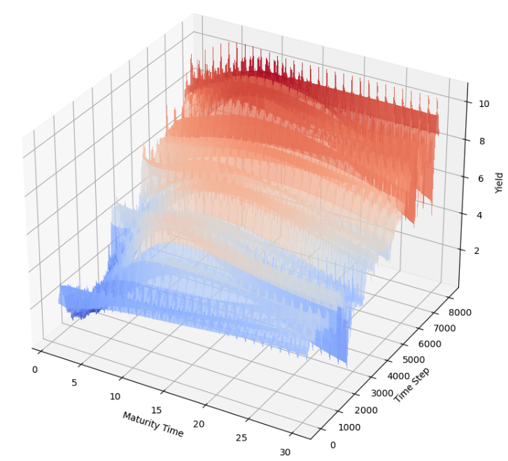
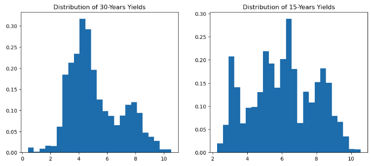
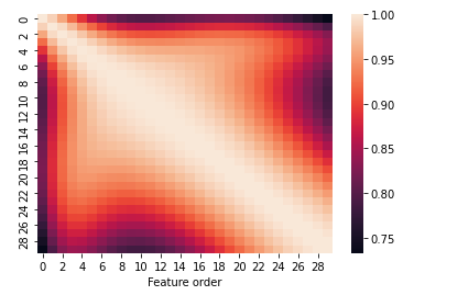
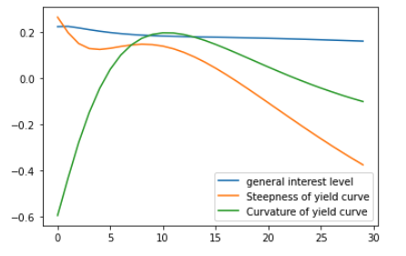
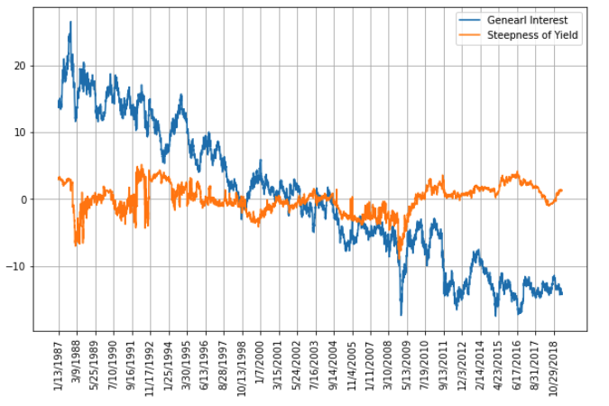

[toc]

# EDA

## Yield Curves

We could find that longer periods of maturity gives us higher yield. However, there are certainly rare cases when longer maturity has less yield.

## Surface of Yield Data Over Time

The above are the plots describing the change of yields of a single bond. This is how yield curves are plotted over time, which is a surface. We could genearlly see that the overall yields are decreasing from 1990s to 2010s. However, one thing strange is that it seems the yields will decrease when the maturity is longer than 10-15 years.

## Compare the yield of 30-year maturity and 15-year maturity

Mean of the yields for 30 and 15 years maturity are (5.167370586048809, 6.086309081898163) respectively. After inspect data more carefully, we find that it's true that yield of 15 years if higher than yield of 30 years maturity.

## Correlation Matrix of Features

All features are highly correlated, which should be the fact. Thus, we can try to do some dimension reduction later.

# PCA

The above plot shows why pc1 is general  interest, pc2 is steepness and pc3 is curvature.

The above is the plot that makes money. We could design trading strategies on those features. Really useful.

# Model Results

## Linear Model without PCA

Training r2_score is  0.8916880358470464
Training RMSE is 0.7766533040369833
Testing r2_score is  0.8922659110989897
Testing RMSE is 0.7823695855056898

## Linear Model with PCA

Training r2_score is  0.8473160728140501
Training RMSE is 0.9041938136836065
Testing r2_score is  0.8368788674370293
Testing RMSE is 0.9347407108978255

## SVM Model without PCA

r2_score  for training set: 0.9884828396895233
r2_score  for test set: 0.9890450899262532
RMSE for training set: 0.2666199822063225
RMSE for test set: 0.2644704556858772

## SVM Model with PCA

r2_score for training set: 0.9793425030036284
r2_score for test set: 0.9790756925274986
RMSE for training set: 0.357074501262061
RMSE for test set: 0.36550919062939285

# Conclusion 
- RBF kernel SVM performed best on the original and transformed data. 
- PCA did increase the performance of both model predictions. 
- Traning time for linear regression is much less than RBF SVM.